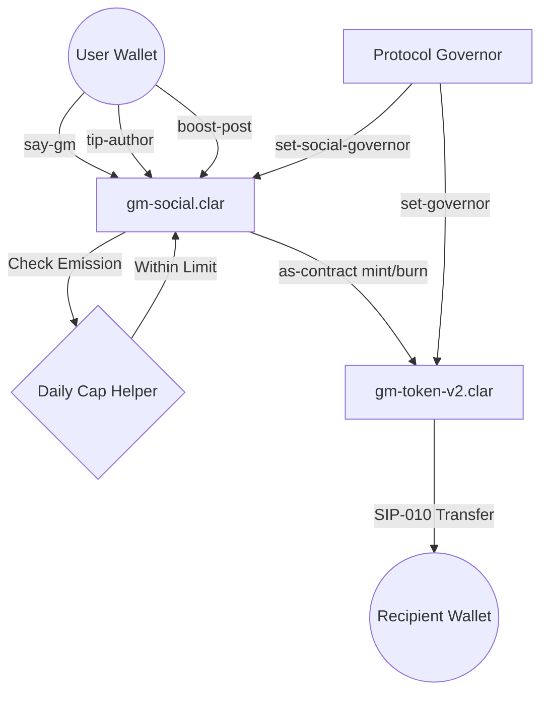

# Gm Social Protocol

[](https://hiro.so/clarinet)
[](https://stacks.co)
[](LICENSE)
[](#security-features)

**Gm Social Protocol** is an on-chain social reputation and engagement system built on the Stacks blockchain. It combines social interaction, token incentives, and DAO governance into a unified protocol where user activity is permanently recorded and rewarded. Built on Bitcoin's security, Gm enables a reputation-based social ecosystem where "GMing" is a core economic action.

---

## Overview

Gm Social Protocol enables users to:

- **Build reputation** through daily engagement (“say-gm”).
- **Earn token rewards** for activity and consistency.
- **Follow other users** and grow social graphs on-chain.
- **Tip creators** using STX directly.
- **Boost content visibility** through token burning.
- **Participate in DAO governance** using token-weighted voting.
- **Access premium features** through a Pro subscription model.

---

## Protocol Architecture



---

## Security Features (V2 Hardened)

The protocol includes multiple safeguards to ensure long-term stability:

- **Macro-Economic Emission Cap**: Global daily limit of 50M micro-GM to prevent uncontrolled token inflation.
- **Anti-Spam Cooldowns**: Enforced block-based limits for key actions:
  - **Follow Cooldown**: ~8.3 hours (50 blocks).
  - **Boost Cooldown**: ~48 hours (288 blocks).
  - **GM Cooldown**: 24 hours (144 blocks).
- **Social Governance**: Dedicated protocol governor for future DAO/Multi-sig evolution.
- **DAO Integrity**: Double-vote prevention included in the proposal system.

---

## Tokenomics & Emission Model

The **$GM Token** is a SIP-010 compliant fungible token regulated through:

- **Daily Mint Cap**: Enforced at the contract level for all rewards.
- **Activity Incentives**: Rewards minted for daily engagement and "Gratitude" tipping.
- **Velocity Control**: Token burns are used to weight content visibility (Boosting).
- **Authorization**: Controlled minting via the authorized Social Protocol governor only.

---

## Smart Contracts

### 1. [gm-social.clar](file:///c:/Users/DELL/Desktop/gm-dapp/contracts/gm-social.clar)

Main protocol logic responsible for:

- User reputation and streak tracking.
- Social graph management and follower counts.
- Boosting, Tipping, and Pro subscription handling.
- DAO proposal and voting aggregation.

### 2. [gm-token.clar](file:///c:/Users/DELL/Desktop/gm-dapp/contracts/gm-token.clar)

SIP-010 compliant governance asset:

- Minting strictly controlled by the Protocol Governor.
- Native support for supply tracking and standard SIP-010 interactions.

---

## Data Structures

- **Users Map**: Stores profile metadata, streaks, reputation points, and Pro subscription status.
- **Social Graph**: On-chain mapping of followers and following counts.
- **Governance Proposals**: Tracks titles, expiration blocks, and weighted voting results.

---

## Development Setup

### Prerequisites

- [Clarinet](https://github.com/hirosystems/clarinet)
- [Stacks Wallet](https://www.hiro.so/wallet)

### Installation

```bash
# Install dependencies
npm install

# Run contract checks
clarinet check

# Run tests
npm test
```

### Divine Bot Helpers

The repository includes helper scripts for the `divine.ts` friend-farmer bot.

```bash
npm run bot
npm run divine:balance-check
npm run divine:username-sync
npm run divine:state-report
npm run divine:reset-state
npm run divine:health-check
```

Use `.env` or `.env.example` to configure the bot flags.

---

## Roadmap

- [ ] Snapshot-based voting system upgrade
- [ ] Multisig governor implementation (DAO transition)
- [ ] Reputation decay mechanism
- [ ] Advanced anti-sybil protections
- [ ] Indexer integration for real-time analytics

---

## Contributing

We welcome contributions from the **Stacks** and **Talent Protocol** communities!

1. Fork the Project
2. Create your Feature Branch (`git checkout -b feature/AmazingFeature`)
3. Commit your Changes (`git commit -m 'Add some AmazingFeature'`)
4. Push to the Branch (`git push origin feature/AmazingFeature`)
5. Open a Pull Request

---

**Gm.**
