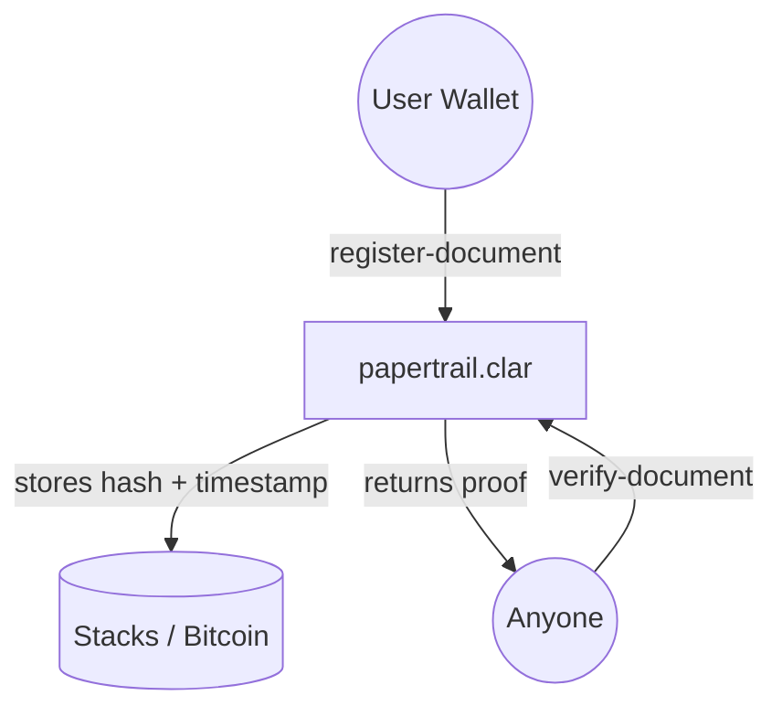

# PaperTrail

[](https://stacks.co)
[](https://bitcoin.org)
[](LICENSE)

**PaperTrail** is an onchain document verification platform built on the Stacks blockchain. Register any document permanently. Share a verification link. Anyone can confirm it's genuine — instantly, permanently, for free.

---

## Overview

PaperTrail enables users to:

- **Register documents** — hash any file and anchor its fingerprint to the Bitcoin blockchain via Stacks.
- **Verify instantly** — anyone with the verification link can confirm a document's authenticity without a wallet.
- **Share proof** — generate a shareable verification URL for contracts, certificates, agreements, and more.
- **Own your records** — all document proofs are tied to your Stacks wallet address, fully self-sovereign.

---

## How It Works



---

## Smart Contract

### [papertrail.clar](./contracts/papertrail.clar)

Core protocol responsible for:

- Anchoring SHA-256 document hashes to the Stacks blockchain.
- Storing registration timestamp and registrant address.
- Providing a public `verify-document` read function — no wallet required.
- Emitting registration events for indexer consumption.

---

## Tech Stack

- **Framework**: Next.js (App Router)
- **Blockchain**: Stacks (Clarity smart contracts)
- **Wallet**: `@stacks/connect`
- **Database**: Supabase (off-chain metadata cache)
- **Styling**: Tailwind CSS + custom CSS variables
- **3D Background**: Three.js via `@react-three/fiber`

---

## Development Setup

### Prerequisites

- [Node.js 18+](https://nodejs.org)
- [Clarinet](https://github.com/hirosystems/clarinet)
- [Hiro Wallet](https://www.hiro.so/wallet) (for local testing)

### Installation

```bash
# Install dependencies
npm install

# Run the dev server
npm run dev

# Run contract checks
clarinet check
```

### Environment Variables

Copy `.env.example` to `.env.local` and fill in:

```env
NEXT_PUBLIC_APP_URL=http://localhost:3000
NEXT_PUBLIC_STACKS_NETWORK=testnet
NEXT_PUBLIC_CONTRACT_ADDRESS=<your-testnet-address>
NEXT_PUBLIC_CONTRACT_NAME=papertrail
NEXT_PUBLIC_SUPABASE_URL=<your-supabase-url>
NEXT_PUBLIC_SUPABASE_ANON_KEY=<your-supabase-anon-key>
```

---

## Roadmap

- [ ] Document registration (Day 5–6)
- [ ] Public verification page (Day 7–8)
- [ ] Dashboard — my documents (Day 9–10)
- [ ] Shareable verification links (Day 11)
- [ ] Leaderboard — top registrants (Day 12–13)
- [ ] Mainnet deployment (Day 14–15)

---

## Contributing

Contributions welcome from the Stacks community!

1. Fork the Project
2. Create your Feature Branch (`git checkout -b feature/AmazingFeature`)
3. Commit your Changes (`git commit -m 'Add some AmazingFeature'`)
4. Push to the Branch (`git push origin feature/AmazingFeature`)
5. Open a Pull Request

---

**Your documents. Verified by Bitcoin.**
